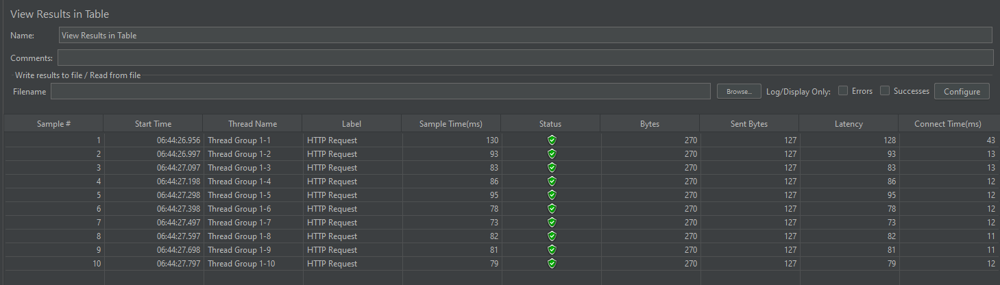
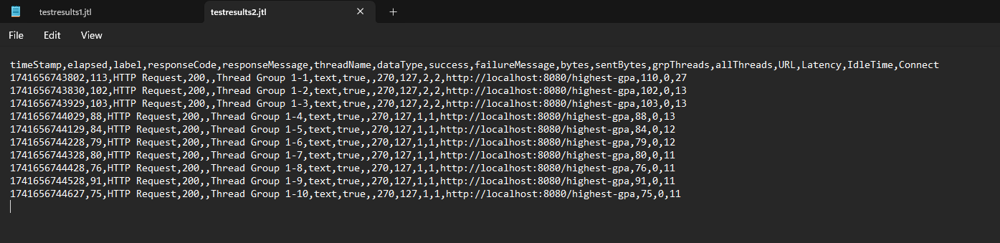

 <h1>Performance Testing and Profiling Reflection</h1>

 <h2> Before and After Images </h2>

| **Query Type**                  | **Before Optimization**                                                                                                                                                                                                                                                         | **After Optimization**                                                                                                                       | **Comparison**                                                                                     |
|----------------------------------|---------------------------------------------------------------------------------------------------------------------------------------------------------------------------------------------------------------------------------------------------------------------------------|-----------------------------------------------------------------------------------------------------------------------------------------------|------------------------------------------------------------------------------------------------------|
| **All Students Query**           |                       |                                         |                                                      |
| **All Student Name Query**       |      |                    |                                                  |
| **Highest GPA Query**            |                          |                                   |                                                             |

<h2> Explanation </h2>
We can see from the changes between the before and after of all the functions that the code has been optimized by atleast 40-95%. This was achieved by constantly testing the new solutions against the old test results while still using the same data and tests. This allowed me to improve and optimize all the code  while maintaining core functionality. I used both Jmeter and IntelliJ profiling to keep the tests and checks fair and ensuring coverage across all functions.

<h2> Difference Between JMeter Performance Testing and IntelliJ Profiling </h2>

The difference I notice is the type of metric that either one is testing. I can see from the start that in intelliJ profiling the goal is to show the performance of the code. When I used it I can see that bad code that was bloated or greedy was marked red. So it was more so as a way to detect where I can improve. On the other hand the Jmeter performance test had a more real world scenario. So it was more realistic and determening whether a piece of code was realistically good. Both are different in how they test and what those results mean but ultimately both are needed to fully understand and improve the code.

<h2> How Profiling Helps Identify Weak Points </h2>

Profiling using IntelliJ was straightforward, it allowed me to find the application's weaknesses. For example, it indicated that loading student courses with a loop performed a number of slow data queries. It also indicated useless concatenation of strings in the joinStudentNames() method that used up memory unnecessarily. These pointers allowed me to focus my optimization  on the parts of the application that needed it. The profiler provided insight into method execution time and memory usage. This helped me realize the root causes of performance issues and allowed me to create solutions to it. I feel this is super useful in bigger apps with alot of code and little resources.

<h2> Effectiveness of IntelliJ Profiler in Identifying Bottlenecks </h2>

IntelliJ Profiler was helpful in showing code bottlenecks. It gave a graphical representation of method calls, their time, and the level of resources used. This helped me to pinpoint slow methods, like the initial solution to finding the student with the highest GPA. After checking, I found that many methods could have been improved and I did just that. The profiler indicates in read the most resource greedy parts of the function like in the findallstudentcourses() which was just super slow and resource intensive. With the help of the profiler I managed to revise the code.

<h2>Challenges Faced and Solutions</h2>

One of the challenges was to decide whether bottlenecks were the result of slow code or database issues. For example, slow queries mostly happened because of missing indexes, which was not immediately obvious from JMeter tests themselves. I resolved this by correlating IntelliJ Profiler outputs with database optimizations, for example, I optimize the way I take data from the database when dealing with gpa.

Another challenge was that optimizations should not compromise the application. For this, I used a conservative testing approach, carrying out unit and integration tests after every major modification. This made sure that every alteration was safe and improved performance without bringing about issues.

<h2> Benefits of IntelliJ Profiler </h2>

I think the main benefits of using the intellij profiler is that it is really helpful in directing code development. Primarily it was useful in allowing me to test as I go, whenever I make a solution or change I can test it with the profiler and I can identify whether I have performed better or worse with the solution I offered. In a way it is a test driven type of development process which was time saving and very intuitive. It allowed me to improve my code and test new solutions that I otherwise would have ignored.

<h2> Handling Inconsistencies Between Profiling and Performance Testing </h2>

Data from IntelliJ Profiler and JMeter were not in agreement at certain points. IntelliJ Profiler may identify a slow method, yet JMeter reported general performance issues due to network delay or even just general latency. In managing this, I tested under controlled environments and compared I tried running both JMeter and IntelliJ profiler using the same runtime and query. An understanding of what each tool was searching for allowed me to get a better general picture and know the best way to improve. Just like before knowing these things allowed me to understand what I need to improve such as intelliJ allowing better optimization while Jmeter more real life application.

<h2> Strategies for Optimization and Maintaining Functionality </h2>

Based on what I had learned while testing and profiling, I applied a series of methods to optimize the code. These included cutting long database queries, optimizing loops, and optimizing strings so that they were faster. For example, I maximized the student-course retrieval function to reduce unnecessary queries as well as improve performance.

In order to make sure that the changes didn't affect functionality, I followed a test-driven approach. I tested with each change and kept an eye on performance in order to catch any issues early on. This made sure that the improvements were both effective and consistent with what I desired.

